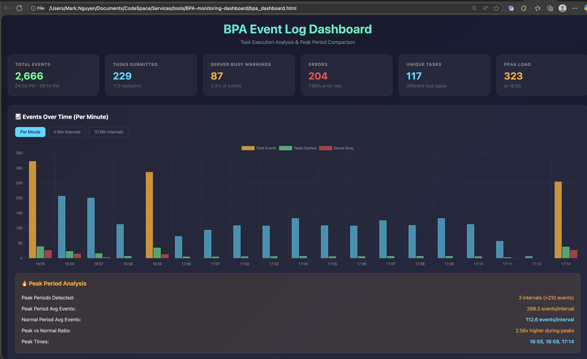

# BPA Monitoring Dashboard

> A visual dashboard for analyzing event logs from the BPA Codeless Platform



---

## Quick Start

1. Open the dashboard by running this:
   ```bash
   open ./bpa_dashboard.html
   ```

2. Click or drag-and-drop your BPA event log file into the upload area (where to get the file: export in event logs of BPA application)

3. The dashboard will automatically parse and visualize your data

---

## Features

### Summary Stats
At-a-glance metrics including:
- Total events
- Tasks submitted
- Server busy warnings
- Errors count
- Unique tasks
- Peak load indicator

---

### Events Over Time Chart
Bar chart showing events per configurable time intervals (1min / 5min / 10min):

| Color | Meaning |
|-------|---------|
| Orange | Peak periods (>1.5x average) |
| Blue | Normal periods |
| Green | Tasks started |
| Red | Server busy warnings |

---

### Peak Period Analysis
Automatically detects and compares peak vs normal periods:
- Number of peak intervals detected
- Average events during peak vs normal
- Peak to normal ratio (load comparison)

---

### Event Types Distribution
Pie chart breakdown of event categories:
- Information
- Warning
- Error

---

### Task Submission vs Server Busy
Line chart correlating task submission timing with server busy reports — useful for identifying capacity bottlenecks.

---

### Top 15 Most Active Tasks
Horizontal bar chart highlighting which tasks generate the most events.

---

### Peak vs Normal Comparison
Side-by-side bar chart comparing metrics between peak and normal periods:
- Average events
- Average tasks submitted
- Average server busy warnings
- Average errors

---

### Errors & Warnings Table
Detailed list of recent errors and warnings with timestamps for quick troubleshooting.

---

## Use Cases

- **Performance Monitoring** — Identify peak load periods and capacity issues
- **Troubleshooting** — Quickly locate errors and warnings in your BPA workflows
- **Capacity Planning** — Understand task distribution and server load patterns
- **Audit & Reporting** — Visualize BPA activity for stakeholder reviews
